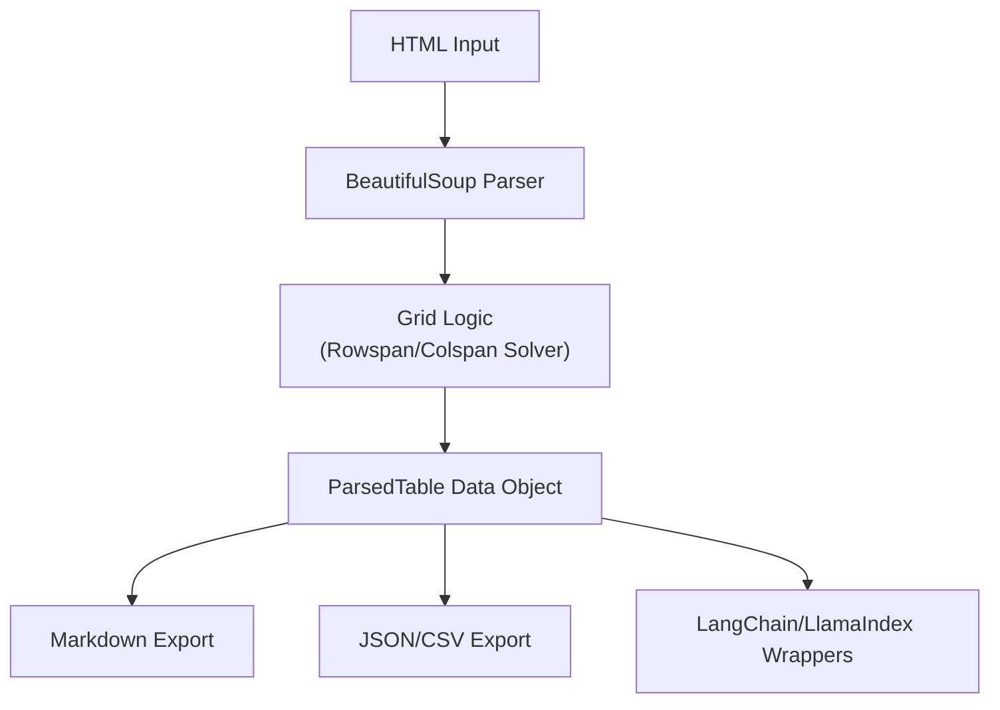

# html-table2md

A robust Python tool to extract complex HTML tables and convert them into clean Markdown, JSON, or CSV formats.

Unlike simple formatters, this library features a **Grid Logic Solver** that correctly interprets `rowspan` and `colspan` attributes, normalizing complex HTML grids into perfectly aligned data structures.

## How is this different from other `table2md` packages?

There is an existing package called `table2md` on PyPI.

* The **existing package** is a *formatter*. You feed it Python lists/dicts, and it draws a Markdown table.

* **This package** is an *extractor and parser*. It takes raw HTML source code, uses `BeautifulSoup` to parse the tags, mathematically resolves complex cell spans (rowspans/colspans), and builds an internal representation before exporting to Markdown.

## Architecture

Our pipeline ensures that complex HTML structures are safely converted without data loss or misalignment:



## Installation

```bash
pip install html-table2md
```

## Quick Start

```python
from table2md.core import TableParser

html_content = """
<table border="1">
  <tr>
    <th colspan="2">Header</th>
  </tr>
  <tr>
    <td>Data 1</td>
    <td>Data 2</td>
  </tr>
</table>
"""

# Initialize parser with your HTML
parser = TableParser(html_content)

# Parse all tables in the HTML
tables = parser.parse()

if tables:
    table = tables[0]
    
    # Export to Markdown (perfect for LLM context windows)
    print(table.to_markdown())
    
    # Export to JSON
    # print(table.to_json())
    
    # Export to CSV
    # print(table.to_csv())
```

## Features

* [x] HTML parsing via `BeautifulSoup`
* [x] Recursive inline-tag formatting (keeps links, bold, and italic tags alive even if nested in divs)
* [x] Complex `rowspan` and `colspan` grid resolution (using flexible strategies like filling cells with "dito" to preserve context for LLMs)
* [x] Clean Markdown export
* [x] **Data Exports:** JSON and CSV serialization from the `ParsedTable` object
* [x] **AI Integrations:** Includes a ready-to-use `LangChain` Document Loader

## 🤝 Contributing

Contributions are welcome! Please feel free to submit a Pull Request.

## License

This project is licensed under the MIT License.
