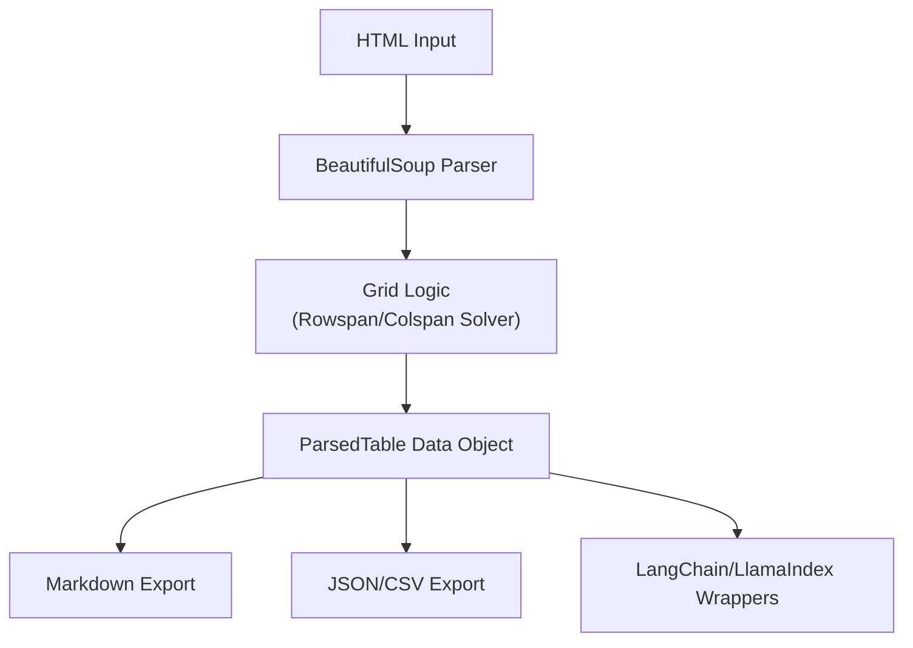

# html-table-rescuer

A robust Python tool to extract complex HTML tables and convert them into clean Markdown, JSON, or CSV formats.

Unlike simple formatters, this library features a **Grid Logic Solver** that correctly interprets `rowspan` and `colspan` attributes, normalizing complex HTML grids into perfectly aligned data structures.

## How is this different from other `table2md` packages?

There is an existing package called `table2md` on PyPI.

* The **existing package** is a *formatter*. You feed it Python lists/dicts, and it draws a Markdown table.

* **This package** is an *extractor and parser*. It takes raw HTML source code, uses `BeautifulSoup` to parse the tags, mathematically resolves complex cell spans (rowspans/colspans), and builds an internal representation before exporting to Markdown.

### The Problem:
Most parsers turn this `<td rowspan="2">` into a misaligned mess:
```bash
| Header | Value |
|---|---|
| Spanned | Row 1 |
| Row 2 | |   <-- Everything shifts!
```

### The Solution:
`html-table-rescuer` uses a grid solver to correctly normalize the matrix:
```bash
| Header | Value |
|---|---|
| Spanned | Row 1 |
| dito (Spanned) | Row 2 |
```
## Architecture

Our pipeline ensures that complex HTML structures are safely converted without data loss or misalignment:



## Installation

```bash
pip install html-table-rescuer
```

(The import name stays `table2md`.)

## Quick Start

```python
from table2md import TableParser

html_content = """
<table border="1">
  <tr>
    <th colspan="2">Header</th>
  </tr>
  <tr>
    <td>Data 1</td>
    <td>Data 2</td>
  </tr>
</table>
"""

# Initialize parser with your HTML
parser = TableParser(html_content)

# Parse all tables in the HTML
tables = parser.parse()

if tables:
    table = tables[0]
    
    # Export to Markdown (perfect for LLM context windows)
    print(table.to_markdown())
    
    # Export to JSON
    # print(table.to_json())
    
    # Export to CSV
    # print(table.to_csv())
```

## Command Line

The package installs a `table2md` command that reads from a file, a URL, or stdin:

```bash
# From a file
table2md page.html

# From a URL
table2md https://example.com/page.html

# From stdin (pipe or '-')
curl -s https://example.com/page.html | table2md
cat page.html | table2md - --format json
```

Options:

| Option | Description |
|---|---|
| `--format`, `-f` | Output format: `markdown` (default), `json`, `csv` |
| `--strategy`, `-s` | Rowspan fill strategy: `fill_dito` (default), `repeat`, `empty` |
| `--dito-prefix` | Prefix used by the `fill_dito` strategy |
| `--table`, `-t` | Extract only the table with this index (0-based) |
| `--output`, `-o` | Write to a file instead of stdout; with CSV and multiple tables, writes `name_1.csv`, `name_2.csv`, … |
| `--no-links` / `--no-bold` / `--no-italic` | Strip the respective inline formatting |
| `--parser` | BeautifulSoup backend (`lxml` default, or `html.parser`) |

## Features

* [x] HTML parsing via `BeautifulSoup`
* [x] Recursive inline-tag formatting (keeps links, bold, and italic tags alive even if nested in divs)
* [x] Complex `rowspan` and `colspan` grid resolution (using flexible strategies like filling cells with "dito" to preserve context for LLMs)
* [x] Clean Markdown export
* [x] **Data Exports:** JSON and CSV serialization from the `ParsedTable` object
* [x] **CLI:** `table2md` command with file/URL/stdin input and Markdown/JSON/CSV output
* [x] **AI Integrations:** Includes a ready-to-use `LangChain` Document Loader
* [x] Robust against broken real-world HTML: invalid `colspan`/`rowspan` values, HTML comments, and oversized spans are handled gracefully

## 🤝 Contributing

Contributions are welcome! Please feel free to submit a Pull Request.

## License

This project is licensed under the MIT License.


### Blog-Posts: 
> ** Read the 1. blog:** [How to Stop LLMs from Hallucinating on Complex HTML Tables](https://html-table-rescuer.hashnode.dev/how-to-stop-llms-from-hallucinating-on-complex-html-tables-python)
> ** Read the 2. blog:** [How to Stop LLMs from Hallucinating on Complex HTML Tables](https://dev.to/encephos/how-to-stop-llms-from-hallucinating-on-complex-html-tables-python-2e0k)
